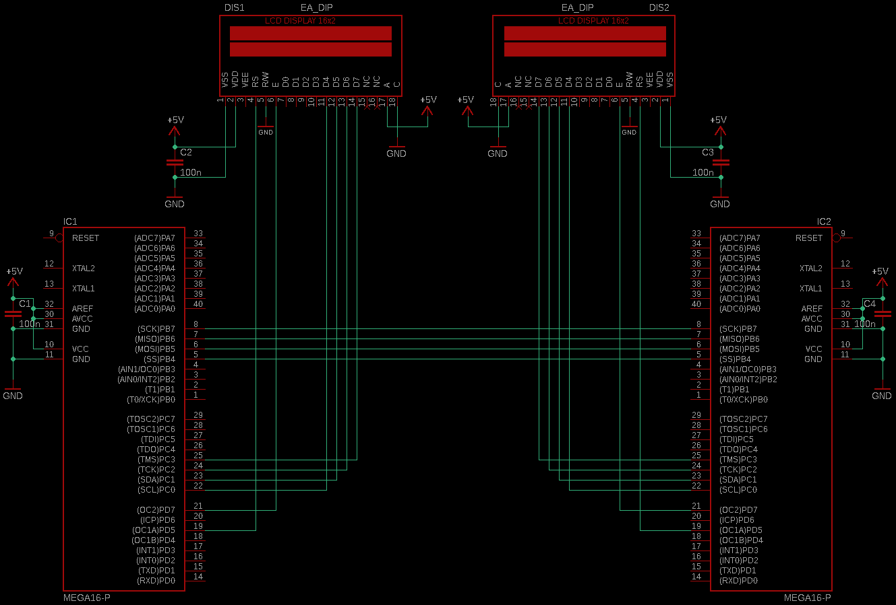

# Master-Slave-SPI-Interface-ATmega16
ATmega16 library for interfacing over SPI.

The library is inside the "SPI" folder, while the example code is inside the "Example" folder.

IMPORTANT: Inside example code, the LCD library which is included is not provided in any of the folders, but any other library for interfacing with LCD display will work just fine. Of course, you can also use any other way of displaying sent/received data.

Sheme for connecting devices:

Hope this code helps you.
